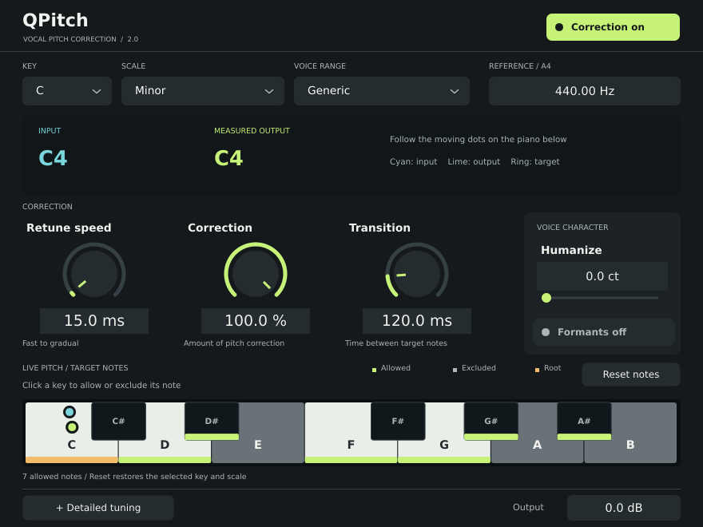

# QPitch

QPitch 2.0 is a JUCE pitch-correction audio plugin with VST3 and CLAP builds.

No bullshit, just a quick, easy to use auto-tuning plugin with formant preservation.

Detects vocal pitch, maps it to the selected notes, and corrects it with stereo-linked Rubber Band processing.



[Watch the demo](docs/qpitch-demo.mp4)

## Dependencies

- CMake 3.21+
- A C++17 compiler
- Git, for cloning submodules and optional CMake dependency fetching

Linux build packages vary by distro. On Ubuntu/Debian, start with:

```sh
sudo apt install build-essential cmake git pkg-config libx11-dev libxext-dev libxinerama-dev libxrandr-dev libxcursor-dev libfreetype-dev libfontconfig1-dev
```

## Build

On Linux, use the Debian 12 build container to keep compatibility with DAW
sandboxes such as Bitwig. Building directly on a newer distro can introduce
unsupported glibc requirements. With Podman or Docker installed:

```sh
tools/linux/build.sh
# Outputs: build-linux-v2/QPitch_artefacts/Release/{VST3,CLAP}
```

The container builds and tests both formats, checks the glibc 2.36 baseline,
and renders the UI under Xvfb. Linux CI/releases use this same build path.
The commands below are for macOS/Windows or native development builds.

Clone with submodules so JUCE is available locally:

```sh
git clone --recurse-submodules https://github.com/Skynse/qpitch.git
cd qpitch
```

If you already cloned without submodules:

```sh
git submodule update --init --recursive
```

Then build:

```sh
cmake -S . -B build -DCMAKE_BUILD_TYPE=Release
cmake --build build --target QPitch_VST3 QPitch_CLAP -j
```

Or with the included preset:

```sh
cmake --preset release
cmake --build --preset release
```

Build outputs:

- VST3: `build/QPitch_artefacts/Release/VST3/QPitch.vst3`
- CLAP: `build/QPitch_artefacts/Release/CLAP/QPitch.clap`

## Build With Vendored Dependencies

JUCE is vendored as a Git submodule at `JUCE/`. `clap-juce-extensions` is fetched by CMake automatically unless a local `clap-juce-extensions/` folder is present.

For a fully offline build, also vendor a compatible copy of:

- `clap-juce-extensions/` including its `clap-libs/clap` and `clap-libs/clap-helpers` subfolders

Then configure with dependency fetching disabled:

```sh
cmake -S . -B build -DQPITCH_FETCH_DEPS=OFF -DCMAKE_BUILD_TYPE=Release
cmake --build build --target QPitch_CLAP -j
```

## Notes

Rubber Band Library 4.0.0 is vendored in `third_party/rubberband` and statically
linked into both plugin formats on Linux, macOS, and Windows. No separate
`librubberband` installation is needed. Its live pitch shifter provides native
formant preservation. The plugin reports its processing latency to the host;
correction off and host bypass use a matching delayed dry path.

The piano edits pitch classes across all octaves. Click a key to allow/exclude
it; use arrow keys and Space when the piano has keyboard focus. Reset notes
restores the selected key/scale. Detailed tuning switches the lower pane from the piano to snappiness, T-Pain,
and tolerance controls; Show piano returns to the keyboard. The default window
is 880 × 660 and switching panes keeps its size unchanged. Click numeric values to type; double-click sliders to
restore defaults. All existing parameter IDs remain compatible with saved sessions.

Rubber Band introduces processing delay (roughly 50 ms or more depending on
sample rate). Host delay compensation aligns playback; it does not remove
live monitoring delay. See `THIRD_PARTY_NOTICES.md` for bundled licences.

Validation:

```sh
cmake --build build --target QPitch_CLAP qpitch_shifter_test qpitch_detector_test qpitch_editor_test -j2
ctest --test-dir build --output-on-failure
# Requires a working display on Linux; writes UI screenshots.
build/qpitch_editor_test /tmp/qpitch-ui-check
```

For a plugin-only build, configure with `-DBUILD_TESTING=OFF`. The optional
offline listening comparison tool is enabled with `-DQPITCH_BUILD_TOOLS=ON`.

## Release

GitHub Releases are created by the `release` workflow. Push a version tag:

```sh
git tag v2.0.0
git push origin v2.0.0
```

The workflow builds Linux, macOS, and Windows VST3/CLAP packages and uploads:

- `QPitch-<version>-linux-vst3.zip`
- `QPitch-<version>-linux-clap.zip`
- `QPitch-<version>-macos-universal-vst3.zip`
- `QPitch-<version>-macos-universal-clap.zip`
- `QPitch-<version>-windows-vst3.zip`
- `QPitch-<version>-windows-clap.zip`

You can also run the release workflow manually from GitHub Actions and provide a version like `v2.0.0`.

The live pitch piano shows cyan input and lime measured output dots, with an outlined target marker. The markers sit directly on the existing white and black note-selection keys; positions include fractional semitones, with the octave shown in the input/output readouts. Output pitch is detected from the processed audio rather than inferred from the correction setting.
