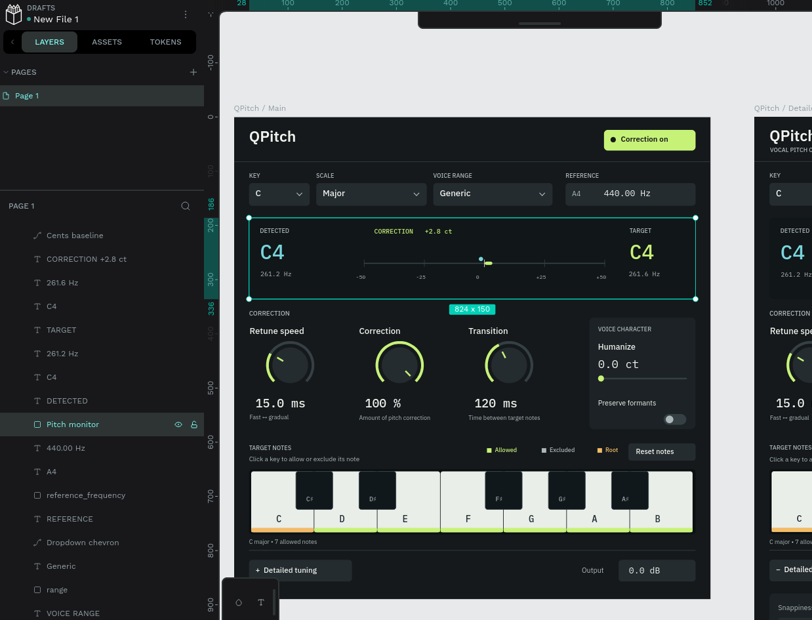

2.0

_____

QPitch 2.0 brings a cleaner, more compact theme, with live pitch markers right on the piano keys.

Also fixed the wet signal becoming too wide and phasey. Stereo processing now keeps the channels aligned, so vocals sound more focused

I spent a bit of time trying to get the UI nice and tidy. The mockup was done using penpot for the design system.

